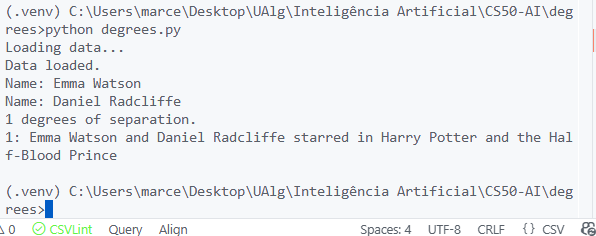
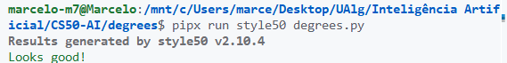
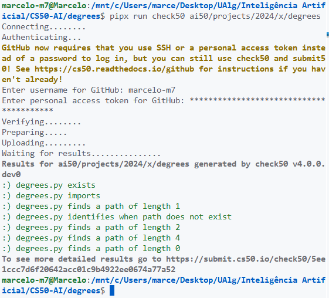

# Trabalho Prático 1 – Degrees

**Disciplina:** Inteligência Artificial – Universidade do Algarve
**Aluno:** Marcelo Santos (a79433)

## Descrição

Este repositório faz parte dos trabalhos práticos da disciplina de Inteligência Artificial, com foco em algoritmos de busca e grafos. O objetivo do TP1 – Degrees é determinar os graus de separação entre atores, ou seja, encontrar o menor caminho de conexões (filmes em comum) entre dois atores do banco de dados.

## Estrutura do Projeto

- `degrees.py`: Script principal que executa o algoritmo de busca.
- `util.py`: Implementação das estruturas de dados utilizadas (nó, fronteira de busca).
- `requirements.txt`: Ferramentas de submissão e validação (submit50, check50, style50).
- Pasta `large/` e `small/`: Bases de dados CSV com informações de pessoas, filmes e participações.
- Pasta `docs/`: Documentação de features e melhorias implementadas.

## Features e Melhorias

- **Melhoria na Visualização**: Adicionada funcionalidade para exibir o caminho encontrado em formato de dataframe (tabela) e grafo (imagem salva). Ver [docs/FEATURE_Improving-visualization.md](docs/FEATURE_Improving-visualization.md) para detalhes.
- **Medição de Tempo**: Adicionada funcionalidade para medir o tempo de execução do algoritmo BFS. Ver [docs/FEATURE_time-measurement.md](docs/FEATURE_time-measurement.md) para detalhes.

## Como Executar

1. Instale os requisitos (opcional, apenas para submissão/validação):

   ```bash
   pip install -r requirements.txt
   ```

2. Execute o programa:

   ```bash
   python degrees.py
   ```

3. Informe os nomes dos atores para calcular os graus de separação.

## Implementação da Função `shortest_path`

A função `shortest_path` é responsável por encontrar o menor caminho entre dois atores utilizando o algoritmo de Busca em Largura (BFS – Breadth-First Search)), ideal para encontrar caminhos mínimos em grafos não ponderados.

### Passos do Algoritmo

1. **Inicialização:**

   - Cria um nó inicial para o ator de origem.
   - Adiciona este nó à fronteira (QueueFrontier), que garante a ordem FIFO típica do BFS.
   - Inicializa um conjunto de estados explorados.

2. **Busca:**

   - Enquanto a fronteira não estiver vazia, remove o próximo nó.
   - Se o nó corresponde ao ator de destino, reconstrói o caminho percorrido e retorna.
   - Marca o nó como explorado.
   - Para cada vizinho (atores que participaram de filmes em comum), verifica se já foi explorado ou está na fronteira. Se não, adiciona à fronteira.
   - Se o destino for encontrado durante a expansão dos vizinhos, reconstrói e retorna o caminho imediatamente.

3. **Reconstrução do Caminho:**

   - O caminho é reconstruído a partir do nó final até o inicial, utilizando os ponteiros de pai de cada nó.
   - O resultado é uma lista de pares `(movie_id, person_id)` que representa cada etapa da conexão entre os atores.

4. **Caso Sem Caminho:**

   - Se a fronteira esvaziar sem encontrar o destino, retorna `None` indicando que não há conexão.

### Exemplo de Uso

Ao executar o programa e informar dois atores, o sistema retorna o número de graus de separação e detalha cada conexão (filme compartilhado).



## Ferramentas de Submissão e Validação

- **submit50:** Submissão oficial do trabalho.
- **check50:** Validação automática dos requisitos do projeto.
- **style50:** Verificação de estilo do código.

---

Universidade do Algarve
**Marcelo Santos – a79433**

[GitHub](https://github.com/marcelo-m7)

## Anexos






