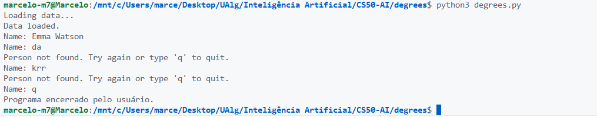

# FUNCIONALIDADE: Evitar Fechamento Abrupto

## Visão Geral

Esta funcionalidade melhora a experiência do usuário ao evitar que o programa termine abruptamente quando um nome de ator não é encontrado. Em vez disso, o sistema permite ao usuário tentar novamente com um nome diferente ou sair voluntariamente digitando "q". Isso torna a interação mais robusta e amigável, especialmente em sessões interativas.

## Detalhes da Implementação

### Mudanças em `degrees.py`

A função `main()` foi modificada para incluir loops de validação para a entrada de nomes de atores:

- **Loop para Ator de Origem**: Um loop `while True` solicita o nome do ator de origem. Se o nome for encontrado, o loop é interrompido. Se não, exibe uma mensagem de erro e continua. Se o usuário digitar "q", o programa encerra graciosamente.

- **Loop para Ator de Destino**: Similar ao anterior, mas para o ator de destino.

### Comportamento Anterior vs. Novo

- **Antes**: Se o nome não fosse encontrado, o programa exibia "Person not found." e terminava imediatamente com `sys.exit()`.
- **Agora**: O programa continua executando, permitindo correções de entrada sem reiniciar o script.

### Dependências

- Nenhuma nova dependência foi adicionada; utiliza apenas módulos padrão do Python (`sys`).

### Uso

1. Execute o programa: `python degrees.py [directory]`.
2. Insira um nome de ator.
3. Se o nome não for encontrado, o programa informa e solicita novamente.
4. Digite "q" a qualquer momento para sair.

### Exemplo de Interação

```text
Name: Ator Inexistente
Person not found. Try again or type 'q' to quit.
Name: Ator Existente
Name: Outro Ator
...
```

## Benefícios

- **Robustez**: Reduz erros de usuário e evita reinicializações desnecessárias.
- **Usabilidade**: Interface mais intuitiva, semelhante a aplicações interativas modernas.
- **Flexibilidade**: Permite correção imediata de erros de digitação.

## Melhorias Futuras

- Adicionar validação adicional para nomes (ex.: verificar formato).
- Implementar histórico de tentativas ou sugestões de nomes similares.
- Suporte para comandos adicionais (ex.: "help" para instruções).

---

## Anexos


