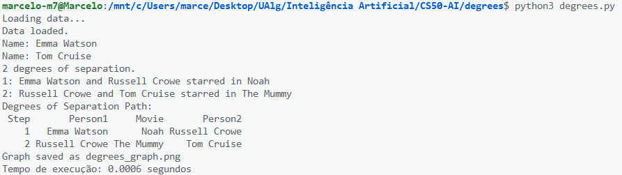

# FUNCIONALIDADE: Busca Bidirecional (Bidirectional BFS)

## Visão Geral

Esta funcionalidade introduz um algoritmo de busca bidirecional (Bidirectional BFS) como alternativa ao BFS unidirecional padrão. O Bidirectional BFS busca simultaneamente a partir do nó de origem e do nó de destino, reduzindo potencialmente o espaço de busca e melhorando a eficiência em grafos grandes e densos.

## Detalhes da Implementação

### Nova Função em `degrees.py`

Uma nova função foi implementada: `bidirectional_shortest_path(source, target)`.

- **Propósito**: Encontrar o caminho mais curto entre dois atores usando busca bidirecional.
- **Parâmetros**:
  - `source`: ID do ator de origem.
  - `target`: ID do ator de destino.
- **Saída**: Lista de tuplas `(movie_id, person_id)` representando o caminho, ou `None` se não conectado.
- **Dependências**: Utiliza as classes `Node` e `QueueFrontier` de `util.py`, e a função `neighbors_for_person`.

### Como Funciona

1. **Inicialização**:
   - Duas fronteiras: uma para a origem, uma para o destino.
   - Conjuntos explorados separados para cada lado.
   - Dicionários para rastrear pais e ações.

2. **Busca**:
   - Expande alternadamente da origem e do destino.
   - Para cada expansão, verifica se o nó expandido foi alcançado pelo outro lado.
   - Se houver interseção, reconstrói o caminho completo.

3. **Reconstrução**:
   - Usa a função auxiliar `reconstruct_path` para combinar os caminhos dos dois lados.

### Vantagens sobre BFS Unidirecional

- **Eficiência**: Pode ser mais rápido em grafos onde a distância entre origem e destino é pequena, pois reduz o número de nós explorados.
- **Teórico**: Em grafos não ponderados, garante o caminho mais curto.
- **Prático**: Em bases de dados grandes, pode reduzir o tempo de execução ao encontrar a interseção mais cedo.

### Integração em `main()`

- A função `main()` foi modificada para usar `bidirectional_shortest_path` em vez de `shortest_path`.
- O resto do código permanece inalterado, garantindo compatibilidade.

### Dependências

- Nenhuma nova dependência externa; utiliza estruturas existentes.

### Uso

O uso permanece o mesmo: execute `python degrees.py [directory]` e insira os nomes dos atores.

### Exemplo de Funcionamento

Para atores A e C conectados via B:

- BFS unidirecional: Explora de A até encontrar C.
- Bidirectional BFS: Explora de A e de C simultaneamente, encontra interseção em B mais rapidamente.

## Benefícios

- **Melhor Desempenho**: Potencial redução no tempo de busca.
- **Escalabilidade**: Mais eficiente para grafos maiores.
- **Mantém Garantias**: Ainda encontra o caminho mais curto.

## Melhorias Futuras

- Comparação empírica com BFS unidirecional em diferentes tamanhos de dados.
- Implementação de heurísticas para otimização adicional.
- Suporte para grafos ponderados (ex.: usando Dijkstra bidirecional).

---

## Anexos

