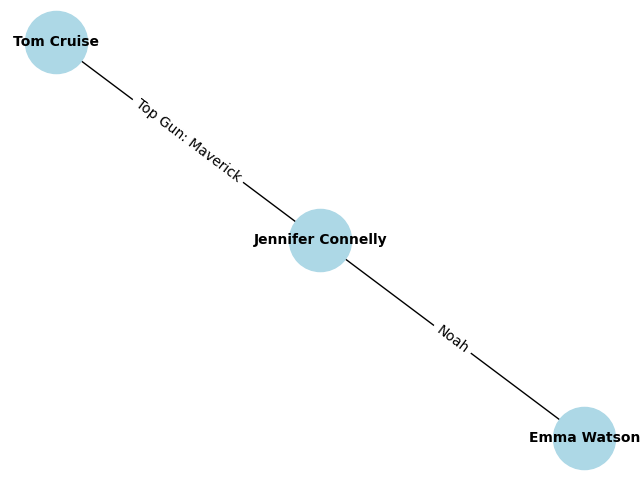

# FUNCIONALIDADE: Melhorando a Visualização

## Visão Geral

Esta funcionalidade introduz capacidades aprimoradas de visualização para o projeto Degrees of Separation. Após encontrar o caminho mais curto entre dois atores, o sistema agora exibe os resultados em dois formatos adicionais: uma tabela de dados tabular e uma representação gráfica de rede. Isso melhora a experiência do usuário, fornecendo insights mais claros e intuitivos sobre as conexões.

## Detalhes da Implementação

### Novas Funções em `util.py`

Duas novas funções foram adicionadas ao `util.py` para lidar com as visualizações:

#### 1. `visualize_path(path, people, movies)`

- **Propósito**: Exibe o caminho como um DataFrame do pandas no console.
- **Parâmetros**:
  - `path`: Lista de tuplas (movie_id, person_id) representando o caminho de conexão.
  - `people`: Dicionário mapeando person_ids para detalhes da pessoa.
  - `movies`: Dicionário mapeando movie_ids para detalhes do filme.
- **Saída**: Uma tabela mostrando cada etapa da conexão, incluindo os atores e o filme em que atuaram juntos.
- **Dependências**: Requer a biblioteca `pandas`.

#### 2. `visualize_path_as_graph(path, people, movies)`

- **Propósito**: Cria uma visualização de grafo NetworkX e salva como arquivo de imagem.
- **Parâmetros**: Os mesmos acima.
- **Saída**: Salva uma imagem PNG (`degrees_graph.png`) mostrando os atores como nós e os filmes como arestas rotuladas.
- **Dependências**: Requer as bibliotecas `networkx` e `matplotlib`.

### Integração em `degrees.py`

- As funções são importadas do `util.py`.
- Na função `main()`, após imprimir o caminho textual, ambas as funções de visualização são chamadas se um caminho for encontrado.
- Isso garante que as visualizações sejam exibidas imediatamente após a saída padrão.

### Dependências Adicionadas

Os seguintes pacotes foram adicionados ao `requirements.txt`:

- `pandas`: Para criação e exibição de DataFrame.
- `networkx`: Para construção de grafo.
- `matplotlib`: Para renderização e salvamento de grafo.

### Uso

1. Execute o programa como de costume: `python degrees.py [directory]`.
2. Insira os nomes dos atores.
3. Se conectados, o programa irá:
   - Imprimir os graus e o caminho textual.
   - Exibir o DataFrame no console.
   - Salvar a imagem do grafo em `degrees_graph.png`.

### Exemplo de Saída

Para um caminho com 2 graus:

- **DataFrame**:

  ```text
  Step Person1          Movie              Person2
  1    Actor A          Movie X            Actor B
  2    Actor B          Movie Y            Actor C
  ```

- **Grafo**: Um diagrama de rede simples com nós para atores e arestas rotuladas com filmes.

## Benefícios

- **Clareza**: O DataFrame fornece uma visão estruturada das conexões.
- **Apelo Visual**: O grafo oferece uma representação visual, tornando os relacionamentos mais fáceis de entender.
- **Extensibilidade**: As funções são modulares e podem ser estendidas para visualizações mais avançadas.

## Melhorias Futuras

- Adicionar exibição interativa de grafo (ex.: usando Plotly).
- Incluir mais detalhes no DataFrame, como anos de nascimento ou anos de filmes.
- Suporte para salvar DataFrames em formatos CSV ou outros.

---

## Anexos

