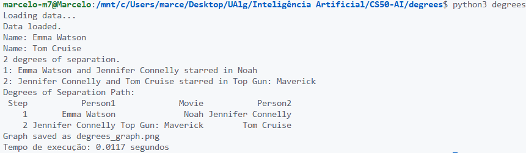

# FUNCIONALIDADE: Medição de Tempo de Execução

## Visão Geral

Esta funcionalidade introduz um mecanismo para medir e exibir o tempo de execução do algoritmo de Busca em Largura (BFS) implementado na função `shortest_path`. Isso permite avaliar o desempenho do algoritmo, especialmente em bases de dados maiores, fornecendo feedback útil sobre a eficiência da busca.

## Detalhes da Implementação

### Nova Função em `util.py`

Uma nova função foi adicionada ao `util.py` para lidar com a medição de tempo:

#### `measure_execution_time(func, *args, **kwargs)`

- **Propósito**: Mede o tempo de execução de uma função arbitrária.
- **Parâmetros**:
  - `func`: A função cuja execução será medida.
  - `*args`: Argumentos posicionais para a função.
  - `**kwargs`: Argumentos nomeados para a função.
- **Saída**: Uma tupla contendo o resultado da função e o tempo de execução em segundos (como float).
- **Dependências**: Utiliza o módulo `time` do Python para medição de alta precisão.

### Integração em `degrees.py`

- A função `measure_execution_time` é importada do `util.py`.
- Na função `main()`, a chamada à `shortest_path` é encapsulada pela função de medição.
- O tempo de execução é exibido no final da execução, formatado com 4 casas decimais para precisão.

### Dependências Adicionadas

- `time`: Módulo padrão do Python, não requer instalação adicional.

### Uso

1. Execute o programa como de costume: `python degrees.py [directory]`.
2. Insira os nomes dos atores.
3. O programa irá calcular o caminho e, ao final, exibir o tempo de execução em segundos.

### Exemplo de Saída

```text
Tempo de execução: 0.1234 segundos
```

## Benefícios

- **Avaliação de Desempenho**: Permite monitorar quanto tempo o algoritmo leva para processar diferentes pares de atores.
- **Otimização**: Facilita a identificação de gargalos e a comparação de melhorias no código.
- **Transparente**: A medição não interfere na lógica principal do algoritmo.
- **Reutilizável**: A função pode ser usada para medir outras funções no projeto.

## Melhorias Futuras

- Adicionar logging detalhado de tempos intermediários (ex.: tempo de carregamento de dados).
- Implementar medição de memória utilizada.
- Suporte para salvar tempos em arquivo para análise posterior.

---

## Anexos


